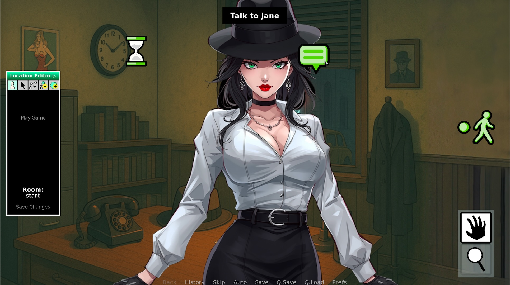

# @phroun/adventure-for-renpy

[](https://opensource.org/licenses/MIT)

*A module to add point-and-click adventure game support to RenPy.*
*If you use this, please support me on ko-fi:  [https://ko-fi.com/jeffday](https://ko-fi.com/F2F61JR2B4)*

[](https://ko-fi.com/F2F61JR2B4)



## Requirements

- **RenPy 7.5 or newer (8.4.1 recommended)**: A python-infused framework for Visual Novels.

## How to Get Started

We are developing a series of step-by-step guides and articles pertaining to Adventure Game development on our blog at
[https://adventure-for-renpy.blogspot.com/](https://adventure-for-renpy.blogspot.com/)

## Features

### Locations

An interactive location is invoked simply by using `call adventure_input("hotel lobby")`
Locations are completely independent from the Ren'Py concepts of Labels or Screens.

### Location Editor UI

The presence of adventure-editor.rpy (not shipped  in a game build) enables the editor UI.

### Natural Language Matching

```rpy
if player_chooses_to("speak to receptionist"):
    "Would you like to check in?"
```

### Automatic History

Player interactions are logged in either first or second person:

```
>>> You speak to receptionist.
```


### Polygons and/or Icons:

There are two systems of clickable elements ("interactables"), which can either be used independently or both together:

- **Clickable Polygons**
  - Define multiple clickable polygons per room, each of which can have customized verb per "layer", or can match with the default group of verbs for a layer.
- **Verb Overlay Icons**
  - Define multiple layers of icons for interaction, each of which has one or more potential verb meanings assigned to it.

### Toolbar

There is an optional in-game **Toolbar** with configurable "Verb Group" Tools

- Only Verb Overlay Icons belonging to the currently activated Tool are visible.
- **Example of Tool Groups for Verbs**:
  - Movement Mode Verbs: Go [-/Through/In/Out/Across]
  - Examine Mode Verbs: Look/Read/Taste/Listen/Smell
  - Operate Mode Verbs: Use/Open/Close/Touch
  - Speak Mode Verbs: Talk To/Speak/Ask
  - Auto-Operate Mode Verbs: Move Mode Verbs + Operate Mode Verbs + (Non-Icon) Examine Mode Verbs

### Persistent and Per-Scene Flags

- Flags must be declared with `adventure_declare_flag("name", "optional description")` which is used to validate all flag references to eliminate bugs due to typographical errors or other inconsistencies.
- Use `adventure_set("flag")` or `adventure_unset("flag")` to manage persistent flags.
- Use `adventure_set_scene("daytime, rainy")` to replace all flags from previous scene.
- Flags are automatically cascaded so that persistent and scene flags can all be tested at once.
- A condition field on each Polygon and Overlay Icon allows interactables to be conditionally enabled/disabled.
- Flags can be tested in code with `if adventure_check_condition("daytime&sunny"):`
  - Condition expressions support & AND, | OR, ! NOT, and () parenthesis.

### Tool Tips (Optional)

When `adventure.active_tip = True` the game will "magically" display tool tips describing the action that will be invoked upon clicking:

- After all failed `player_chooses_to()` tests, include a `jump` statement to jump back to the call to adventure_input.
- Adventure will perform one "dry run" automatically, failing each condition instantly in order to gather the list of match statements.
- When it hits the second invocation of `player_chooses_to()` after the `jump`, it will be in interactive mode, and all of the possible actions for all tool layers will be available as Tool Tips.
- This allows for natural language tips such as "Turn on the light" or "Press the elevator button" even though both are click actions made by the same tool.

## Quick Start

Install by placing the adventure folder into your RenPy Project's game folder.

You now have access to the adventure system:

```rpy
init python:
    adventure_declare_flags([
      ("Int", "Interior scene"),
      ("Ext", "Exterior scene"),
      ("Day", "Present when it is daytime"),
      ("Night", "Present when it is nighttime"),
    ])

label lounge:
    scene bg lounge
    
    # the following will only persist until the next set_scene
    $ adventure_set_scene("int, night")

    call adventure_input("lounge")

    if player_chooses_to("use bell"):
       "You ring the bell and wait a moment.  No one arrives."
    if player_chooses_to("enter the lift"):
        "The elevator door is jammed."
    if player_chooses_to("examine desk"):
        if adventure_check_condition("night"):
           "A card next to a bell says, \"ring for service\""
        else:
           "The hotel clerk stands behind the desk, with his head buried in a dime novel."
    if player_examines(
        ("bell", "It's an old brass hotel bell.  Maybe if I press it, I can get someone's attention?"),
        ("plant", "This potted plant hasn't been watered in years.  In fact, it's plastic."),
        ("chandelier", "A victorian-style chandelier, fitted with electric bulbs.\n"
          "The only gaslighting going on here is that half of these bulbs burned out in "
          "1987 and nobody's bothered to replace them.")
    ):
        pass
    jump lounge
```

## Contributing

1. Fork the repository
2. Create a feature branch: `git checkout -b feature-name`
3. Make changes
4. Test changes
5. Submit a pull request

## License

MIT License - see [LICENSE](LICENSE) file for details.

## Changelog

### 0.2.7
- Added iconset metrics
- Editor GUI can be scaled with `adventure.guiscale = 2`
  - Tested with 1, 1.5, 2 (new default), 2.5, 3

### 0.2.6
- Added magic choice text tags:
  - {prompt}, question at top of choice prompt
  - {event}, marks this choice as a plot event (moves forwad)
  - {cancel}, marks this choice as a cancel option (dismisses)
- Added distintive toolbar icons for "auto", "say", and "go"

### 0.2.5
- Added adventure.choice_position which takes values of: "top", "center",
  "bottom", "left", or "right"
- Added AdventureNineSlice displayable.
- Fixed a bug where the active tool wasn't filtering polygons correctly.

### 0.2.4
- Added `player_examines()` for the common case of multiple descriptions.
- Fixed a bug where not processing MOUSEUP event was causing RenPy text
  speed (CPS) issues.

### 0.2.3
- Added utilities for automatic conversion and installation of game icons.

### 0.2.2
- Improved placement of Editor User Interface.
- Improved documentation in README.md

### 0.2.1
- Added tooltip hint for actions (configurable via adventure.action_tip) 
- Began improving choice/menu layout.

### 0.2.0
- Added Cascading Flags System (Persistent & Scene-Based)
- Implemented Flag Conditionals for Polygons & Overlay Icons
  - Supports & AND, | OR, ! NOT, and () parenthesis in evaluation

### 0.1.11
- Added basic Toolbar Support for Mode Selection

### 0.1.10
- Improved handling of icon verbs
  - We now store the icon name instead of hard-coding the verbs
- Source code cleanup (named constants instead of magic numbers)
- Changed layer tool-icons to a more investigative order (examine, speak, operate, go)

### 0.1.9
- Allow selecting icons or polygons with the arrow tool
- Added verb icon palette
- Clicking an icon now generates a command for the parser

### 0.1.8
- History log now records actions with either first or third person

### 0.1.7
- Added basic parser function:  player_chooses_to()
- Ability to edit Condition on any Interactable

### 0.1.6
- Added Create New Polygon
- Added Create New Icon
- Added Delete option in Point Editor
- Added Verb Editor for Polygons
  - (Prefix with * to invoke an entire verb group)

### 0.1.5
- Added adventure_overlay and adventure_underlay screens
  - (to be redefined by game authors who need advanced customization)

### 0.1.4
- Added "Play" Icon to Hide Editor Polygons
- Added Point Editor Mode to Edit Existing Points
- Added Tool UI Icon to Add a New Polygon

### 0.1.3
- Allow room parameter to be passed directly to adventure_input() call

### 0.1.2
- Moved editing mode features into a separate .rpy file (to exclude from game distributions)
- Allow Saving and Loading Room Data to/from .rpy file

### 0.1.1
- Added To-Do List to README.md

### 0.1.0
- Initial release
- Supports multiple tagged Polygons per Room

## To-Do

### Requirements to achieve 1.0:

- Room-Persistent Flags (Useful for Inventory-Related Tasks)
- Allow Active Scenes to Overload a Room+Verb+Label with a Scene Trigger
  - Generate an Error in Advance if Specified Room+Verb+Label is Undefined

### Upcoming Planned Features:

- Improved Dialogue Styles
- Task & Notes Journal
